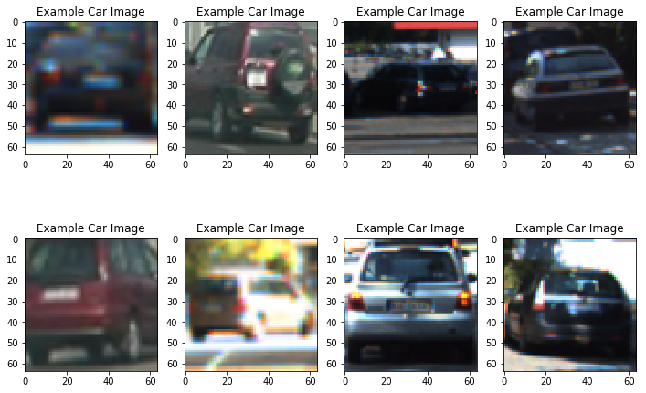
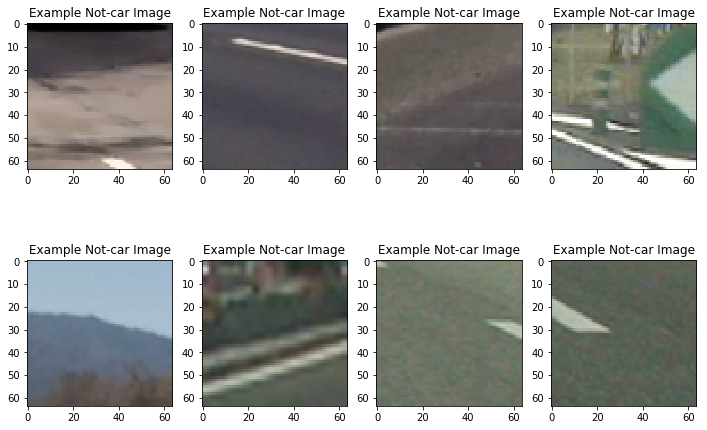
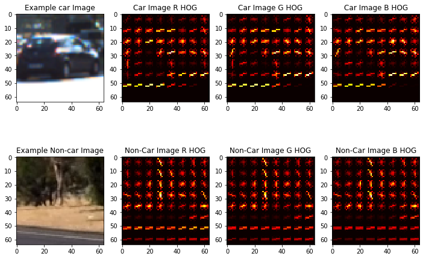
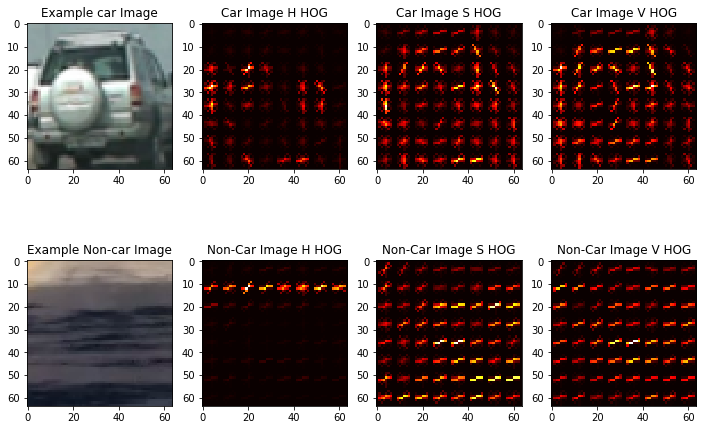
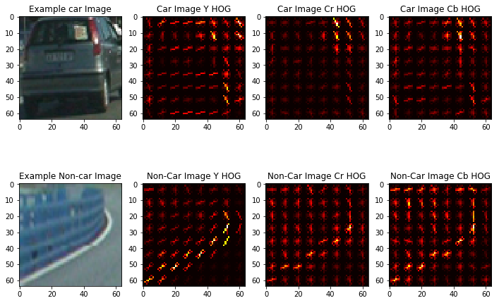
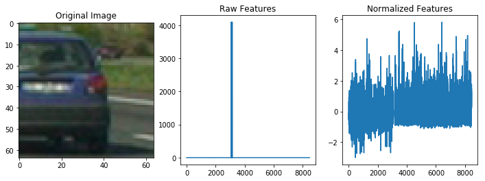
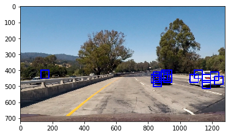
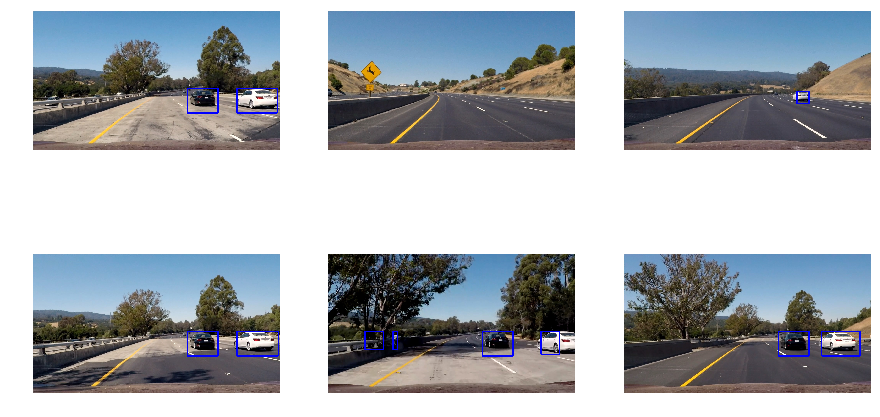

# Vehicle Detection

Author : Manoj Kumar Subramanian

------

## Overview

This repository is as part of my Submission to the Project 5: Vehicle Detection Project for the Udacity Self Driving Car Nano Degree Program.

In this project, the vehicles are found in a video file using the Computer Vision, Histogram of Oriented Gradients (HOG) with Linear Classifier technique. The coding is done in Python in Jupyter Notebook and below report details the list of activities done on this project.

------

## Project Goals

The goals of this project are the following:

- To extract the HOG feature from an image with a set of parameters from the provided list of car and non car train images.
- Use the extracted HOG feature to train a classifier to predict whether an image is containing a car or not.
- To apply a sliding window technique to slice an image into a number of smaller windows that can be passed on to the classifier.
- Draw bounding boxes on the predicted windows that contain the car images.
- Apply a filtering mechanism to avoid false positives.
- Make a pipeline that works with the video frames and updates the frames with the vehicles found, with bounding boxes.
- Submit the final video output.

------

## Rubric Points

### Writeup / README

This README document acts as the submission to meet the Rubric point related to Writeup. The steps followed to achieve the final video output are described in the following sections. 

All the code used in the lecture slides were used to make up this project. The parameters were updated based on the different combination try outs.

------

###Dataset Visualization

To make the classifier, the dataset provided in the project links from the example images of GTI vehicle image database and KITTI vision benchmark suite were used.

The following images provide the visualization for the dataset that are labelled as Vehicles and Non-vehicles.

**<u>Samples of Vehicles (Cars)</u>**

Samples of Non-vehicles

------

###Histogram of Oriented Gradients (HOG)

**<u>1. HOG Extraction</u>**

As per the lectures, using the HOG feature of the color channels provides an additional feature map along with the Histogram color features. The below sample images provide an overlook of how the HOG images look different between a car and a non-car image for various channels.

**<u>For RGB</u>**

 

**<u>For HSV</u>**

**<u>For YCrCb</u>**

**<u>HOG Choice of Parameters</u>**

Based on the code from the lecture modules, the extract_features() function is used to extract the HOG features for different channels along with the Spatial and Histogram binning. 

**<u>Normalizing data</u>**

The extracted data were normalized using the StandardScalar().fit() function.

**<u>Classifier</u>**

The LinearSVC() SVM is used as a classifier to train the extracted features. AWS EC2 (g2.2xlarge) instance is used for the training. The trained values are stored in a pickle file for offline use.

The below table gives the parameters used for training and the test accuracy for each of the configurations.

| S.No  | File Name                             | Configuration                            | Test Accuracy    | Number of features | Time to Extract HOG |
| ----- | ------------------------------------- | ---------------------------------------- | ---------------- | ------------------ | ------------------- |
| 1     | Param_HLS_32s_32h_9o_8p_2c_ALLg       | HLS All channel 32 spatial, 32 HistogramBins, 9 Orients, 8pixels/cell, 2cells/block | 0.9963           | 8460               | 135.35              |
| 2     | Param_HSV_32s_32h_9o_8p_2c_ALLg       | HSV All channel 32 spatial, 32 HistogramBins, 9 Orients, 8pixels/cell, 2cells/block | 0.9972           | 8460               | 140.02              |
| 3     | Param_RGB_32s_32h_9o_8p_2c_ALLg       | RGB All channel, 32 spatial, 32 HistogramBins, 9 Orients, 8pixels/cell, 2cells/block | 0.993            | 8460               | 130.29              |
| 4     | Param_YCrCb_32s_32h_9o_12p_2c_ALLg    | YCrCb All channel, 32 spatial, 32 HistogramBins, 9 Orients, 12pixels/cell, 2cells/block | 0.9924           | 4896               | 92.25               |
| 5     | Param_YCrCb_32s_32h_9o_16p_2c_0g      | YCrCb Y Channel, 32 spatial, 32 HistogramBins, 9 Orients, 16 pixels/cell, 2cells/block | 0.984            | 3492               | 44.47               |
| 6     | Param_YCrCb_32s_32h_9o_16p_2c_ALLg    | YCrCb All channel, 32 spatial, 32 HistogramBins, 9 Orients, 16 pixels/cell, 2cells/block | 0.9918           | 4140               | 83.98               |
| **7** | **Param_YCrCb_32s_32h_9o_8p_2c_ALLg** | YCrCb All channel, 32 spatial, 32 HistogramBins, 9 Orients, 8pixels/cell, 2cells/block | **<u>0.994</u>** | **8460**           | **139.22**          |
| 8     | Param_YUV_32s_32h_9o_8p_2c_ALLg       | YUV All channel, 32 spatial, 32 HistogramBins, 9 Orients, 8pixels/cell, 2cells/block | 0.9921           | 8460               | 135.96              |

Out of these, since the HSV and HLS channels produced a high accuracy, I tried with the HSV in the first iteration. But during the stages of Sliding Window predictions, this produced a lot of false positives detecting the road as cars in the test images.

When tried on HLS, the normalization step produced a divide by zero error and hence discarded this.

Since the YCrCb produced an accuracy in the training set at around 99%, tried different combinations on the orientations, number of pixels per cell and the channels.

Finally the following parameters were set since these produced a higher accuracy among the other parameter sets.

| Feature Parameters         | Values    |
| -------------------------- | --------- |
| Channels                   | YCrCb     |
| Spatial and Histogram Bins | 32, 32    |
| HOG Orients                | 9         |
| HOG Channels               | All YCrCb |
| Pixels per cell            | 8         |
| Cells per block            | 2         |

The stored pickle files were used for the further steps in the project.

------

### Sliding Window

The same sliding window function code from the lecture slides were used.

The following list of images were the initial predictions for the Single Image Features 

| Scale | Sample Image                             | Scale | Sample Image                             |
| ----- | ---------------------------------------- | ----- | ---------------------------------------- |
| 0.8   |  | 0.9   |  |
| 1.0   |  | 1.5   |  |
| 2.0   |  | 2.2   |  |
| 2.4   |  | 2.6   |  |

For above the scale of 2.6, no windows showed a vehicle detection.

Considering the outcome from images above, the scales of 1, 1.5, 2.0 and 2.4 were chosen to be the window scale ranges so that a higher chance shall be given to both bigger car images as well as smaller car images will be able to get detected.

------

### Heat Maps

Since there were few outliers on the detections, the heat maps were used to reject the windows where the measurements were not covered by the nearby windows upon a few threshold.

| Heat Map Thresholds                  | Heat Map Image output                 |
| ------------------------------------ | ------------------------------------- |
| 0 (All detections were considered)   |  |
| 1 (At least two window detections)   |  |
| 2 (At least three window detections) |  |

**<u>Labels</u>**

Used the label() function to create different set of boxes together and assign labels for each. The labelled  heat maps were provided as input to the draw the outer bounding boxes for the detected labels using the draw_labeled_bboxes() function.

------

### Vehicle Detection Pipeline - Image

**<u>Find Cars</u>** 

The find_cars() function is used as the function to extract the features needed to get the classifier predict the detection of cars.

For this, to reduce  time, instead of the HOG extraction under multiple window ranges, 

* the window is sliced to check only for the required region of interest
* based on the scale factor, the image is resized to the required 64,64 window range sizes
* performed HOG for the complete sliced and re-sized image
* Cropped the image into different segments of 64,64 sized images and
* each cropped image is sent to the classifier for the prediction.

For the predicted image, the bounding boxes were detected, rescaled up to match to the original window and sent to the next step of heat map creation.

**<u>Multiple Scale Windows and Heat Maps</u>**

The Find cars function is called with multiple window scales and the heat maps were extracted from each stage.

The final heat maps were labelled and the labelled boxes were drawn on to the original image. Below are the frames for the test images. 

------

### Vehicle Detection Pipeline - Video

Since the same image pipeline produced a wobbling line, in order to smooth out the variations in detections at each frame, a simple averaging filter is introduced using the Vehicle Class. This class stores the recent heat maps in an array and produces the averaged heat map output that is compared to a threshold to provide a smoother and outlier rejected video output.

The link for the final output video is [here](project_video_out.mp4)

------

### Discussion Points

Quite a few point to be discussed in this project when it comes for vehicle detection:

1. The training dataset used in this project were limited to only cars and the classification is done between only cars and non-cars. In practice, a wide variety of vehicle objects that appear on road has to be considered as potential vehicles to detect.

2. The approach used in this project is to use the Open CV methods for HOG feature extraction and the same used for training a set of samples. This approach works in this project but personally, the machine learning based approach used in the Traffic sign classification project (though the training model requirements may differ) to provide a raw image feed and get the image predicted for a certain class might work better in the case of run time execution, since the HOG calculation is a computationally expensive iteration. The expensive computations involved in this approach may make the logic not operable in the practical real time conditions with the standard DSP modules.

3. The video output is still having a few numbers of both False positives and False negatives. 

   * For the False positive - especially in the area where the oncoming traffic car is recognized is a valid prediction as per the model, but based on the lane co-ordinates and the vehicle locations, this has to be discarded on the application level. The false positives on the road detections shall be overcome with the proper differentiations between the different classification objects.
   * For the False negatives - mostly the white car not getting detected when the distance increases after the concrete patch, works out to be the problem of arrangement of the sliding windows and the overlaps between the windows were not sufficient to capture the car without any cropping of the sides. By adding more overlapping and covering with the lesser scale at the horizon area may improve the detections, but the addition of task will lead to additional execution time

4. The sliding window search shall be optimized to search for the left side and right side of the ego vehicle to look for new cars to appear from back, and to look for the area near horizon for the cars that appear from front. Rest of the operations shall be limited to a bounded margin around the already detected vehicle.

5. Since the averaging technique depends on the past frames values only, there might be a lag in the detection area to the actual. In order to avoid this, an approach to predict the next possible location (using Kalman filters) of the identified cars shall be considered. The shall make the bounding box appear exactly on the predicted car's place.

   ​